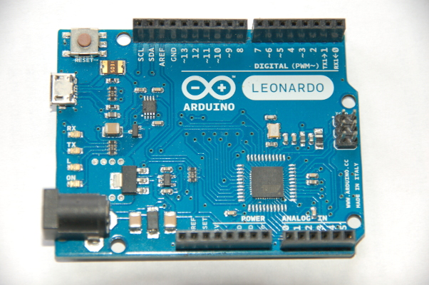

# Überblick

Zunächst möchte ich klarstellen, daß ich zwar mit einem Lötkolben einigermaße umgehen kann, aber kein Elektroniker bin, sondern Software-Entwickler. Also keine Angst beim Nachbauen der hier beschriebenen Wetterstation :-)

Nachdem ich einige Erfahrungen mit der Wetterstation auf meinem Haus sammeln konnte, hat sich der Wunsch nach einer Wetterstation auf unserem [Fluggelände](http://www.fg-daidalos.de/index.php/startseite) förmlich aufgedrängt.
Während die Sensoren mit

1. Windgeschwindigkeit
2. Windrichtung
3. Temperatur
4. Luftfeuchtigkeit
5. Luftdruck
6. Niederschlagsmenge
7. Sonneneinstrahlung

... weitgehend identisch sind, bringen zwei Aspekte echte Herausforderungen:

1. Daten-Upload über Mobilfunknetz
2. Solare Stromversorgung

Aufgrund der positiven Erfahrungen mit [Weather Underground](http://www.wunderground.com) (Darstellung der Daten, Historisierung der Daten, Upload-Schnittstelle, Zuverlässigkeit) soll auch bei dieser Wetterstation der Daten-Upload dorthin erfolgen.

Die __aktuellen Werte der Wetterstation__ lassen sich über ein Widget in beliebige Webseiten anzeigen (Werte in Grafik nicht aktuell, sondern nur statische Grafik). Durch einen Klick darauf kommt man direkt auf die WeatherUnderground-Seite mit den Detailinformationen.

[](http://www.wunderground.com/personal-weather-station/dashboard?ID=IHESSENN7)

# Datenupload über Mobilfunknetz

Für die Integration des Arduino in das Mobilfunknetz hat man grundsätzlich die Wahl zwischen GPRS und UMTS. Für beide Mobilfunkstandards werden unterschiedliche Arduino-Shields angeboten. Weil die Wetterstation nur kleine Datenmengen transferiert, ist ein relativ günstiger Shield auf Basis des {[SIM900](http://wm.sim.com/producten.aspx?id=1019) ausreichend. Aufgrund der guten Dokumentation habe ich mich für den 
[EFCom GPRS/GSM Shield von ElecFreaks](http://www.elecfreaks.com/wiki/index.php?title=EFCom_GPRS/GSM_Shield) entschieden.

Der GSM-Shield wird mit einer kleinen Stummelantenne geliefert. Weil die Elektronik der Wetterstation in einen kleinen Schaltschrank eingebaut werden soll, ist eine __externe Antenne__ erforderlich. Ich habe mich für eine DeLock-Antenne mit 3 dBi, Magnetfuß und 2m Kabel mit SMA-Konnektor entschieden.

Für den GSM-Shield wird die __Bibliothek__ [GSM-GPRS-GPS-Shield](https://github.com/MarcoMartines/GSM-GPRS-GPS-Shield) benötigt. Ich habe die Version 3.07.1 verwendet.
Dabei hat sich schnell gezeigt, daß der Speicher der Arduinos mit 32K RAM (Uno, Leonardo) damit fast vollständig belegt ist. Also habe ich aus der Bibliothek alle Funktionen entfernt, die nicht für HTTP notwendig sind (SMS, Voice, ...). Außerdem habe ich in GSM.cpp die für TX und RX verwendeten Pins angepaßt - dazu später mehr. Die angepaßte Bibliothek findet sich ebenfalls auf [Github](https://github.com/camueller/GSM-GPRS-GPS-Shield).

Natürlich wird für den GSM-Shield eine __SIM-Karte__ benötigt und es stellt sich die Frage nach dem Provider. Die meisten Provider haben nur Tarife mit vielen Flats oder reine Datentarife mit großem Volumen. Für den Upload der Wetterdaten benötigen wir aber nur einen Tarif mit geringem Datenvolumen ohne Telefonie und SMS. Glücklicherweise hat [Congstar](http://www.congstar.de) gerade den Tarif [Prepaid wie ich will](https://www.congstar.de/prepaid/prepaid-karte) eingeführt, bei dem man Datenvolumen, SMS und Telefonie selbst konfigurieren kann. Für die Wetterstation habe ich 100 MB ohne Telefonie und SMS konfiguriert, was im Ergebnis zu einer __Monatsgebühr von 2 Euro__ führt - und das im gut ausgebauten Telekom-Netz!

Ich habe auch Tests im __EPlus__-Netz gemacht, indem statische Daten per HTTP-Post zu Weather Underground hochgeladen werden sollten. Im Gegensatz zum Telekom-Netz kam dabei immer folgende Fehlermeldung:
```
HTTP/1.0 502 Bad Gateway
Cache-Control: no-cache
Connection: close
Content-Type: text/html

<html><body><h1>502 Bad Gateway</h1>
The server returned an invalid or incomplete response.
</body></html>
```

Beim Testen des Daten-Uploads mit dem GSM-Shield ist es wichtig, daß der Arduino durch ein __Netzteil__ mit Strom versorgt wird, weil er während des Sendens mehr Strom benötigt, als die USB-Schnittstelle eines Laptops oder PCs liefern kann. Andernfalls hat man den Eindruck, daß der GSM-Shield nicht funktioniert, tatsächlich liegt es aber an der unzureichenden Stromversorgung. In meinem Fall war ein Netztteil mit 9V und 660 mA ausreichend für die Tests der kompletten Wetterstation.

# Arduino

Für die Wetterstation habe ich einen {link:Arduino UNO|https://www.arduino.cc/en/Main/ArduinoBoardUno} verwendet. Dieser bietet 2 Interrups - gerade genug, da sowohl der Windgeschwindigkeitssensor als auch der Regenmesser einen Interrupt benötigen.

Die Jumper des EFCom-GSM-Shields nur die Verwendung der Pins D0 bis D3 zu, die aber wegen der Interrupts auf diesen Pins für die Sensoren benötigt werden. Abhilfe ist [hier](https://code.google.com/p/gsm-shield-arduino/issues/detail?id=53) beschrieben: TX und RX mit D10 und D11 verbinden und die Pin-Nummern in _GSM.cpp_ ändern:

```
//De-comment this two lines below if you have the
//second version og GSM GPRS Shield
//#define _GSM_TXPIN_ 2
//#define _GSM_RXPIN_ 3 
#define _GSM_TXPIN_ 10
#define _GSM_RXPIN_ 11 
```



Die Elektronik für die fertige Wetterstation bestehend aus Arduino, dem Shield für Sensorelektronik und dem GSM-Shield ist auf den beiden nachfolgenden Bildern zu sehen.


# Sensoren

Theoretisch kann man mechanische Sensonen für Windrichtung, Windgeschwindigkeit und Regenmenge selbst bauen und irgendwie an einem Mast befestigen. Wesentlich leichter ist es, wenn man sich eine __Ersatz Ausseneinheit WH1080__ kauft, die alles beinhaltet, was bei einer [WH1080](http://wiki.wetterstationen.info/index.php?title=WH1080_/_WS1080) außen montiert wird: Mast und Sensoren inklusive Halterungen. Für deren Sensoren für Windrichtung, Windgeschwindigkeit und Regenmenge git es auch [Dokumentation](pics/WeatherSensorAssembly.pdf).


Die Elektronik im [Stevenson-Screen](http://de.wikipedia.org/wiki/Thermometerh%C3%BCtte) habe ich komplett entfernt und durch eine Platine mit den von mir gewählten Sensoren ersetzt:
Zur Messung der __Temperatur__ verwende ich einen [Maxim DS18B20](https://datasheets.maximintegrated.com/en/ds/DS18B20.pdf), der günstig ist und durch das 1-Wire-Protokoll digital ausgelesen werden kann.
Bei der Messung der __Luftfeuchtigkeit__ ist es wichtig, einen Sensor zu wählen, der bis zum Taupunk korrekt messen kann, was beim [Honeywell HIH-5031](http://sensing.honeywell.com/index.php?ci_id=49692) der Fall ist.
Sämtliche Kontakte habe ich mit Heisskleber "ummantelt", damit es durch Tauwasser keine ungewollten Verbindungen gibt. Die Öffnung für die Kabelbuchsen habe ich durch ein Stück Plastik vom "geschlachteten" Solar-Aufsatz verschlossen, daß mit Heisskleber abgedichtet wurde.


Bis vor kurzem wußte ich nicht, daß ein Meßgerät zum Messen der __Sonneneinstrahlung__ [Pyranometer](http://de.wikipedia.org/wiki/Pyranometer) genannt wird. Die Messung dieser Größe hat mir die meisten Kopfzerbrechen bereitet. Da es mir nicht um eine theoretische Abhandlung des Themas geht und kommerzielle Meßgeräte schnelle vierstellige Euro-Beträge kosten, habe ich gezielt nach Do-It-Yourself-Lösungen zu diesem Thema gesucht. Zwei Ansätze habe ich dabei gefunden: Solarzelle und Photo-Dioden. Beide sind abhängig vom Einfallwinkel der Sonnenstrahlung, d.h. man muß den Sensor entweder dem Sonnenlauf nachführen oder mehrere Sensoren verwenden. Nachdem ich [diesen Bericht](http://www.icrepq.com/icrepq'10/598-Laghrouche.pdf) zu dem Thema gelesen hatte, entschied ich mich für die sehr kostengünstige Lösung mit __8 Photo-Dioden BPW34__ (10 Stück kosten ca. 5 Euro), deren Strom ziemlich linear zur Lichteinstrahlung verläuft. Diese sind auf einem __Alu-Flachband__ angebracht, das __kreisförmig__ gebogen ist und gegen die Horizontale geneigt ist. Die Neigung soll der Neigung der __Sonnenlaufbahn__ entsprechen, die man sich für einige deutsche Städte [hier](http://cgi.stadtklima-stuttgart.de/mirror/sonne.exe) im Jahresverlauf zeigen lassen kann. 
Weil sich die Sonnenlaufbahn aber im Jahresverlauf ändert, mußte ich eine durchschnittliche Sonnenlaufbahn für meinen Wohnort festlegen. Diese ist 200 Grad in der Horizontalen und 40 Grad gegen den Horizont geneigt. Auf dieser durchschnittlichen Sonnenlaufbahn sind die 8 Photo-Dioden auf dem Alu-Flachband platziert. Alle freiliegenden Kontake der Photo-Dioden habe ich mir __Heisskleber__ vor Feuchtigkeit geschützt.


